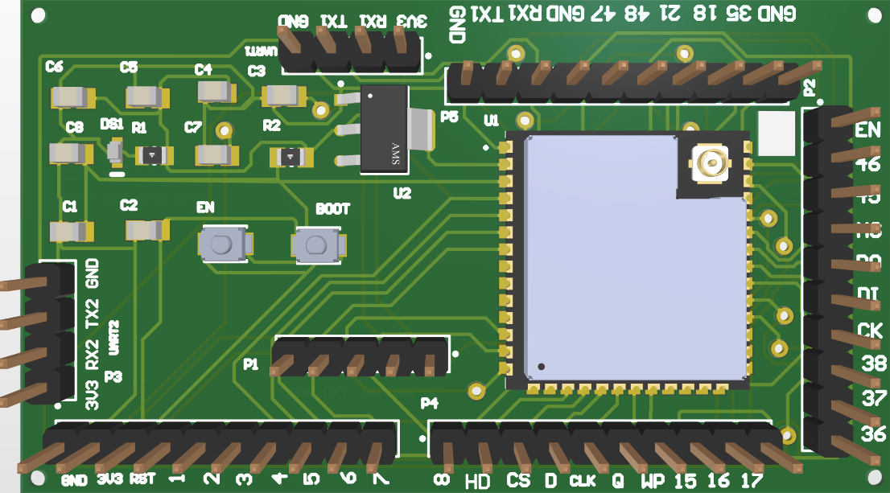
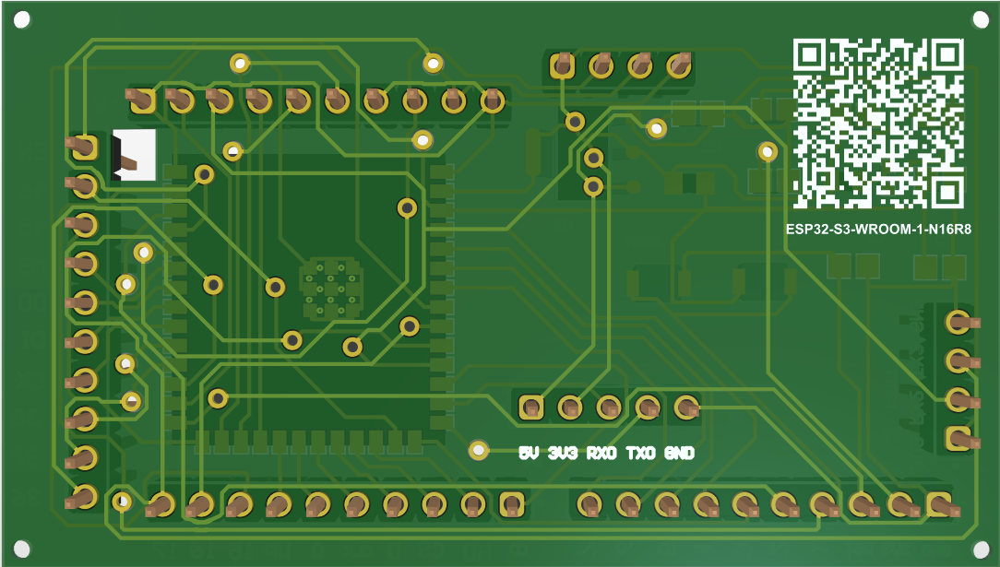

 ESP32_S3_N16R8_CUSTOM_GAURAVKHIRADE
A CUSTOMIZED FULLY FUNCTIONAL ESP32 S-SERIES BOARD i.e., ESP32 S3 N16R8.

 ESP32-S3 Custom Board (Designed in Altium Designer)

 Overview

This repository contains the design files and documentation for the custom ESP32-S3 board created using Altium Designer. The board leverages the powerful ESP32-S3-WROOM-1U module for advanced IoT applications with both Wi-Fi and BLE connectivity.

 Front View

 Back View

 Design Details

- Designed in: Altium Designer
- Microcontroller: ESP32-S3-WROOM-1-N16R8
- PCB Layers: 2-layer design
- Connectivity: Wi-Fi, BLE (Bluetooth Low Energy)
- Power Supply: 5V input via USB, onboard 3.3V regulator
- Programming: UART (TX, RX) interface
- Component Package Types: 0603, SMD, THT

 Special Features
- Programming and Debugging: Includes EN and BOOT buttons for easy flashing of firmware.
- Pin headers: Exposed GPIO pins, SPI, I2C, and UART connections.
- Antenna: Onboard U.FL connector for an external antenna.

 Pinout and Connectors

- P1: GPIO 1-6 (General Purpose I/O)
- P2: GPIO 15-21 (General Purpose I/O)
- P3: UART2 (TX, RX), 3.3V, GND
- P4: SPI Interface (CLK, MOSI, MISO, CS)
- P5: EN (Enable), BOOT (Flash mode)

 Power Supply
- The board is powered via a 5V input through USB.
- Onboard 3.3V regulator to power the ESP32-S3 and peripherals.

 Project Files

- Altium Designer Files: Includes schematic, PCB layout, and Gerber files for manufacturing.
  - `Schematic.SchDoc`
  - `PCB.PcbDoc`
  - `Gerber.zip`
  
 How to Use

1. Install Arduino IDE or ESP-IDF  to program the ESP32-S3.
2. Connect the board via UART using TX, RX, and GND pins.
3. Hold the "BOOT" button and press "EN" to enter the flash mode for programming.
4. Use the ESP32-S3 pins for GPIO, I2C, SPI, or UART interfaces based on your project needs.

 License

This project is open-source. Feel free to modify the design for your use, but kindly give credit if you find the design helpful.
